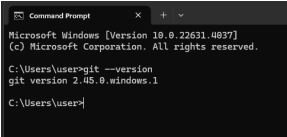
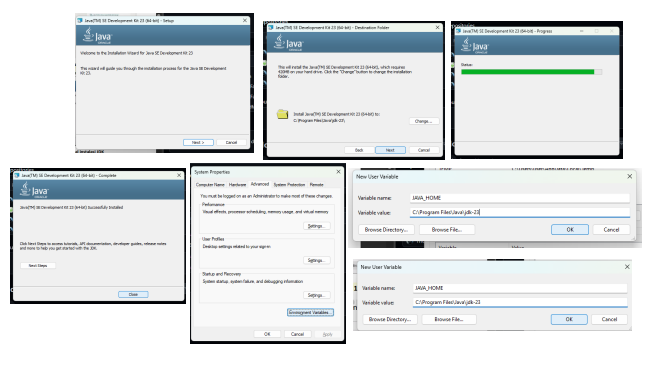
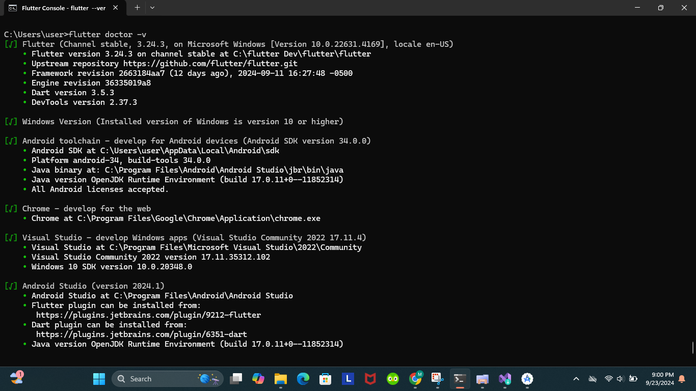
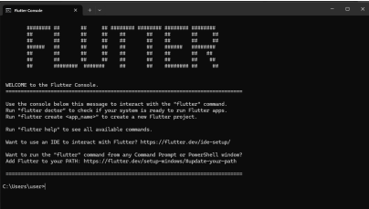
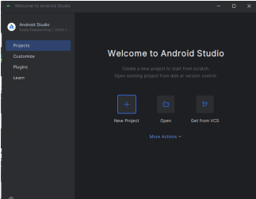
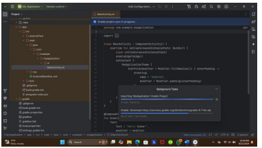
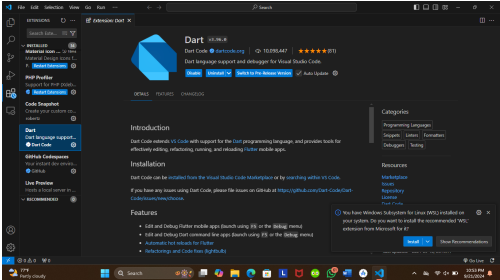
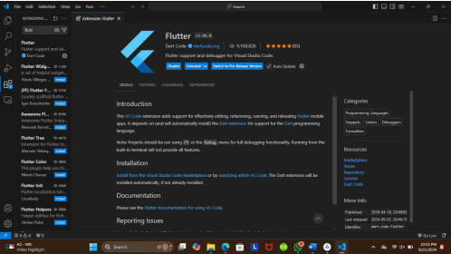

## PPB_Muhammad Fariz Nur Hidayat_2211104069_SE-06-2/01_Running-Modul/LP_01

<li> Nama   : Muhammad Fariz Nur Hidayat
<li> NIM    : 2211104069
<li> Kelas  : SE-06-02

# screenshot Git sudah terinstall
<li> screenshot Git sudah terinstall

# JDK Terinstall
<li> Screenshot jdk 

# screenshot flutter sudah terinstall
<li> screenshot flutter sudah terinstall

# Bukti Install Android Studio
<li> Screenshot android studio sudah terinstall

# Bukti Install SDK Android
<li> Screenshot SDK Android sudah terinstall

# Installasi Extensions pada visual studio code
<li> Screenshot visual studio code dan extensions "Dart" juga "Flutter"

 

