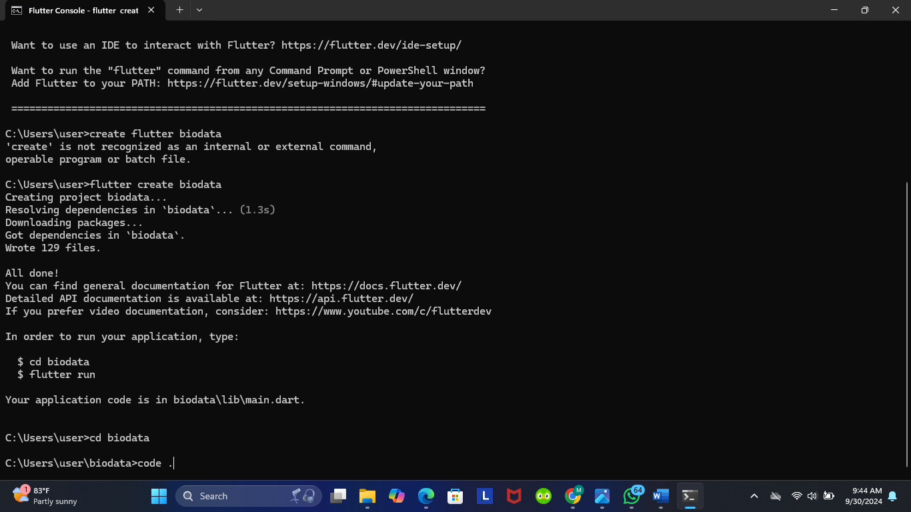
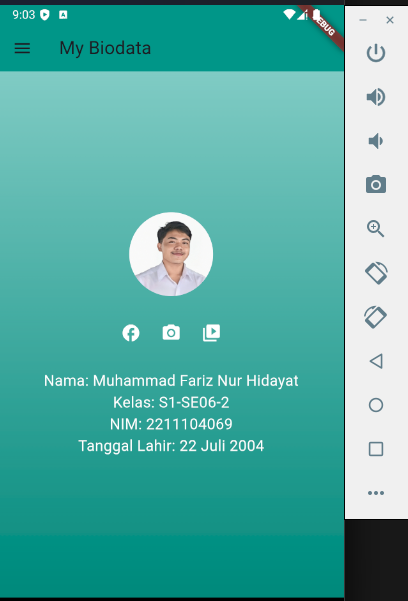
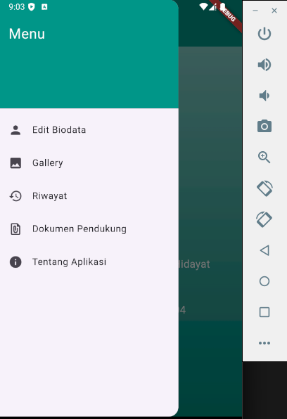
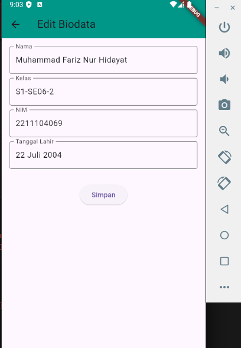
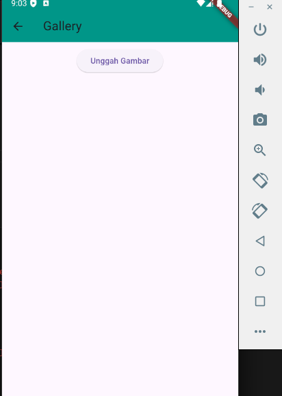
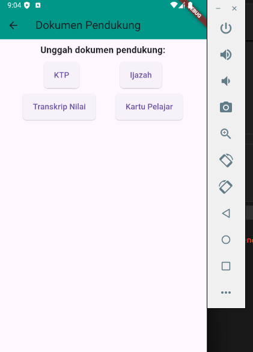
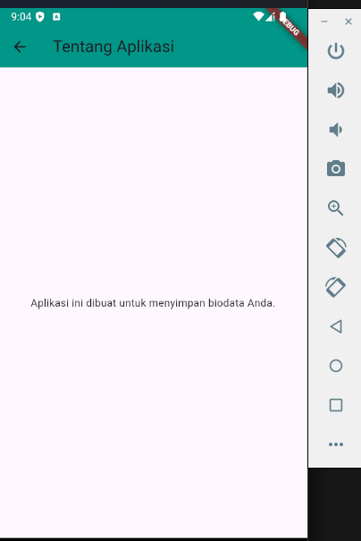

## PPB_Muhammad Fariz Nur Hidayat_2211104069_SE-06-2/02_Pengenalan-Flutter/LP_02

<li> Nama   : Muhammad Fariz Nur Hidayat
<li> NIM    : 2211104069
<li> Kelas  : SE-06-02

# Tugas Praktikum Modul 2 Pengenalan Flutter
# 1) Jelaskan apa itu Dart & Flutter beserta contoh widget yang ada pada Flutter

<li> 1.	Dart dan Flutter adalah dua komponen utama yang digunakan untuk mengembangkan aplikasi cross-platform, terutama pada mobile, web, dan desktop.  
Dart: 
•	Dart adalah bahasa pemrograman yang dikembangkan oleh Google. Bahasa ini dirancang untuk pengembangan aplikasi yang cepat dan efisien, terutama untuk kebutuhan front-end, seperti pada aplikasi web dan mobile. 
•	Dart memiliki sintaks yang mirip dengan bahasa pemrograman lain seperti JavaScript, C++, atau Java, sehingga cukup mudah dipelajari bagi mereka yang sudah familiar dengan bahasa-bahasa tersebut. 
•	Dart digunakan oleh Flutter sebagai bahasa utama untuk mengembangkan aplikasi, meskipun Dart juga dapat digunakan di luar Flutter. 
Flutter: 
•	Flutter adalah framework open-source yang juga dikembangkan oleh Google. Flutter digunakan untuk membuat antarmuka pengguna (UI) dari aplikasi yang berjalan pada berbagai platform (iOS, Android, web, desktop) dengan satu basis kode. 
•	Flutter sangat fokus pada performa, memungkinkan pengembang untuk membuat aplikasi dengan UI yang kaya, animasi yang halus, dan responsivitas tinggi. Ini dimungkinkan karena Flutter tidak menggunakan komponen UI bawaan dari platform melainkan menggambar UI sendiri menggunakan mesin rendering berbasis grafis. 
Contoh Widget di Flutter: 
Widget adalah elemen dasar dalam Flutter yang membangun struktur antarmuka pengguna. Setiap elemen visual dalam aplikasi Flutter adalah widget, baik itu layout, tombol, atau teks.

# 2) Buatlah sebuah project Flutter

# 3) Setelah berhasil, modifikasi halaman diatas untuk menampilkan biodata
kalian, minimal 5 widget!! (bebas, buatlah sekreatif mungkin).

# Screenshot tampilan home
<li> Halaman Home dengan navigasi facebook,instagram,dan youtube di bawah foto profil

# List Menu
<li> Screenshot tampilan list menu 

# Screenshot Menu Edit Biodata
<li> Screenshot halaman menu edit biodata

# Screenshot Menu Gallery
<li> Pengguna dapat mengunggah gambar ke gallery 

# Screenshot Menu Riwayat
<li> Menampilkan riwayat perubahan biodata

# Screenshot Menu Dokumen Pendukung
<li> Pengguna dapat mengupload dokumen pendukung seperti ktp,ijazah,kartu pelajar, dan transkrip nilai

# Screenshot Menu Tentang Aplikasi
<li> menampilkan informasi tentang aplikasi

